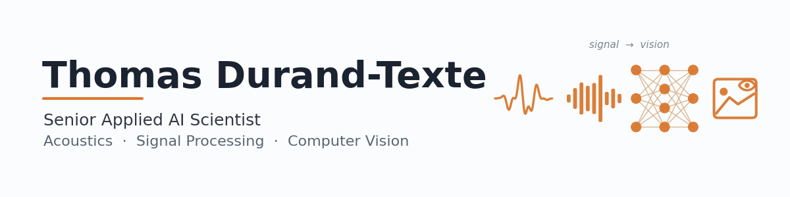

<picture>
  <source media="(prefers-color-scheme: dark)" srcset="assets/banner_dark.png">
  
</picture>

🎓 PhD in Acoustics · MSc Electro-Acoustics · Engineer (ENSIM) · ML Engineer (CentraleSupélec/OC)
🔬 10+ years in R&D: vibrations, 3D vision, signal processing, deep learning
🏢 Currently: R&D Engineer @ iAudiogram · Previously: LAUM, ACOEM, Valéo, Harman

## 🔥 Highlights

| Project                                                                                            | Impact                                          |
|----------------------------------------------------------------------------------------------------|-------------------------------------------------|
| **[DL for Digital Image Correlation](https://github.com/Thomas-Durand-Texte/DIC-Neural-Networks)** | ×420 speedup, -82% error, -83% resolution limit |
| **[Efficient audio tagging](https://github.com/Thomas-Durand-Texte/audio-tagging-portfolio)**      | 200 labels from scratch, no AudioSet · [live demo](https://apcen-tagger-web.vercel.app) |
| **Speech-in-noise audiometry (ML)**                                                                | ~50% exam time reduction                        |
| **Audiometric calibration automation**                                                             | -65% total time, -95% human time                |
| **[Thermo-mechanical modelling of an ABH](https://github.com/Thomas-Durand-Texte/thermo-mechanical-model)** | Where damping happens, not just how much |
| **[3D acoustic FDTD](https://github.com/Thomas-Durand-Texte/ac-fdtd)** | Room impulse responses validated to round-off · compiled CPU beats the GPU |
| **Vibration modeling**                                                                             | FEM-equivalent model at -99.5% compute          |

## 🔊 Featured: Efficient Multi-Label Audio Tagging

> **▶ [Try it in the browser](https://apcen-tagger-web.vercel.app)** — drop in a clip and see the 200-label predictions.

A learned, **physically-grounded DSP front-end** — an ERB SuperGaussian filter bank with an adaptive per-band AGC (APCEN) — feeding **two model lines**, both trained **from scratch on FSD50K, with no AudioSet pretraining**:

- **Line 1 — shared-encoder multi-head CNN.** Peak-pool, modulation-spectrum and transformer-SED heads over one encoder, fused by a per-class gate. Four runs changing one thing at a time: **0.735 lwlrap at 5.06M parameters**, then a cached front-end and a data pipeline that manufactures the multi-event clips the labels imply — worth **+0.016 mAP on an otherwise identical model**, the largest non-architectural gain in the project.
- **Line 2 — `bp-attn-1`, a two-scale windowed-attention pyramid.** Attention reads a whole 30 s recording instead of aggregating fixed chunks: **the project's best mAP (0.605) and macro-F1 (0.564) at ~4–6× the training throughput.** Its headline result is a diagnosis → prediction → confirmation arc — a *missing frequency prior*, identified from per-class errors on harmonic instruments and fine transients, fixed by keeping frequency a real axis through the trunk, and better on **178 of 200 classes**.

Three repos:

- **[audio-tagging-portfolio](https://github.com/Thomas-Durand-Texte/audio-tagging-portfolio)** — the write-up: the front-end story, an STFT-vs-analytical-filter-bank stem comparison, the data-pipeline A/B, and an honest per-class analysis of both lines — including where each model *loses*
- **[apcen-multihead-tagger](https://github.com/Thomas-Durand-Texte/apcen-multihead-tagger)** — the code + pretrained weights: infer / evaluate / fine-tune / predict, verified **bit-identical** to the research model
- **[apcen-tagger-web](https://github.com/Thomas-Durand-Texte/apcen-tagger-web)** — the browser demo above

## 🌡️ Featured: Where Vibration Energy Is Lost, from a Thermal Video

A structure vibrates, some energy is dissipated, that energy becomes heat, and an infrared camera sees it. **[thermo-mechanical-model](https://github.com/Thomas-Durand-Texte/thermo-mechanical-model)** models every step of that chain — and then runs it backwards, recovering how much power a structure dissipates *and where* from thermal imaging alone.

Damping is normally characterised globally, as a modal loss factor, which says nothing about location. Four coupled models close that gap: a three-layer beam of varying thickness solved by impedance transport, the dissipated power from closed-form through-thickness integrals, one-dimensional heat transfer on control volumes, and the heat equation read as a residual to invert the chain.

- Validated against an **independent finite-element solution**, **laboratory vibrometry and infrared measurements**, and a dozen **closed-form results** that have truth values
- Applied to **Acoustic Black Holes**, and reproducing from geometry alone what the published thermal-imaging work identifies from measurement
- Includes the **negative results** — a hypothesis that predicted the right sign and still failed, a per-cell estimate that does not work, and a measurement that cannot identify what it was hoped to

## 🏛️ Featured: Room Impulse Responses, Validated to Round-Off

**[ac-fdtd](https://github.com/Thomas-Durand-Texte/ac-fdtd)** simulates the sound field in a room from the wave equation: a 3D finite-difference time-domain solver with locally reacting walls, an absorbing layer for free field, and the full **ISO 9613-1 air absorption** — then made fast enough to be useful.

The interest is in what is checked and what is measured, not in the scheme, which is textbook:

- **Every claim is tested against a case with an exact answer.** Energy conservation to **4.4e-16**, a single mode staying a single mode to **1.3e-13** over 3000 steps, the free-field Green's function to **0.21 %**, ISO 9613-1 attenuation to **1.2 %** across 20–80 % humidity. Where the reference is *not* exact — reverberation time against Sabine — the simulation agrees within 4–8 % above the Schroeder frequency and departs by 29 % below it, **which is the correct answer**: statistical theory does not apply there, and agreement would have meant the code was reproducing the formula instead of the physics.
- **The compiled CPU loop beats the GPU, for a reason worth knowing.** MPS has more than twice the CPU's streaming bandwidth and loses by 20–40 %, because a step written as whole-array operations moves forty passes over memory where a fused C loop moves 48 bytes per cell. Eliminating velocity entirely is **five times faster again**. Fix the resolution, fuse the loop, then choose the device — not the order the specifications suggest.
- **The resolution is the expensive decision, not the hardware.** Cost scales as the fourth power of the bandwidth resolved, so the grid is where the run time is won or lost. The scheme's dispersion relation is closed-form: ten points per wavelength buys 1.1 % phase velocity error, 1 % costs 10.5 points, and at the stability limit the scheme is **exact** along the body diagonal — which is why backing off the Courant number for safety costs 60 % more cells for the *same* accuracy.

Three backends (NumPy, PyTorch on CPU/MPS/CUDA, C with pthreads) agree bitwise in double precision. 100 tests.

## 📚 Training Portfolio

**[Machine Learning Engineer Projects](https://github.com/Thomas-Durand-Texte/OC-formation-Ingenieur-Machine-Learning)** — Portfolio of ML projects from OpenClassrooms/CentraleSupélec training program

## 🛠️ Tech Stack

**Languages & Frameworks:** `Python` `PyTorch` `scikit-learn` `NumPy` `pandas` `SQL` `C/C++` `React` `LaTeX` `Matlab` `Simulink`

**Tools & Platforms:** `Docker` `Git` `Linux` `macOS` `Blender`
💻 10+ years Linux & macOS experience

## 📄 Selected Publications

- *Single-camera vision method for vibration measurement* — J. Sound Vib. (2020)
- *Thermal imaging of acoustic black hole damping* — J. Appl. Phys. (2020)
- *Thermal imaging of vibrational energy dissipated in a 2D acoustic black hole pit* — Appl. Phys. Lett. (2021)
- *Comparison of full-field optical techniques* — Nature Sci. Rep. (2023)

## 📫 Contact

✉️ thomas.durandtexte@protonmail.com · 📍 France · 🌐 Open to remote & hybrid roles
